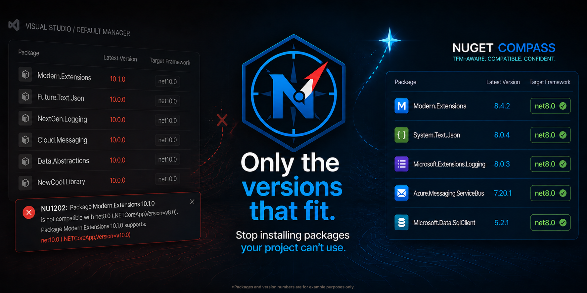

<p align="center">
  
</p>

# nuget-compass

A VS Code extension for managing NuGet packages in .NET Core / .NET 5+ projects, with first-class **target framework (TFM) compatibility filtering**.

## Why this exists

Default NuGet package manager UIs show the "latest" version of every package regardless of whether it actually targets your project's framework. On a `net8.0` project, you'll see `net10.0`-only packages offered as updates, and "Update All" happily tries to install them — usually resulting in `NU1202: Package X is not compatible with net8.0`.

`nuget-compass` is built around the assumption that **every version offered to you should be one you can actually install**.

## Status

Early development. Repo: [Wutname1/nuget-compass](https://github.com/Wutname1/nuget-compass).

## Repo layout

```
nuget-compass/
├── fixtures/   # Test .NET projects used during development
└── packages/   # Source code (pnpm workspace)
```

## License

MIT — see [LICENSE](LICENSE).
